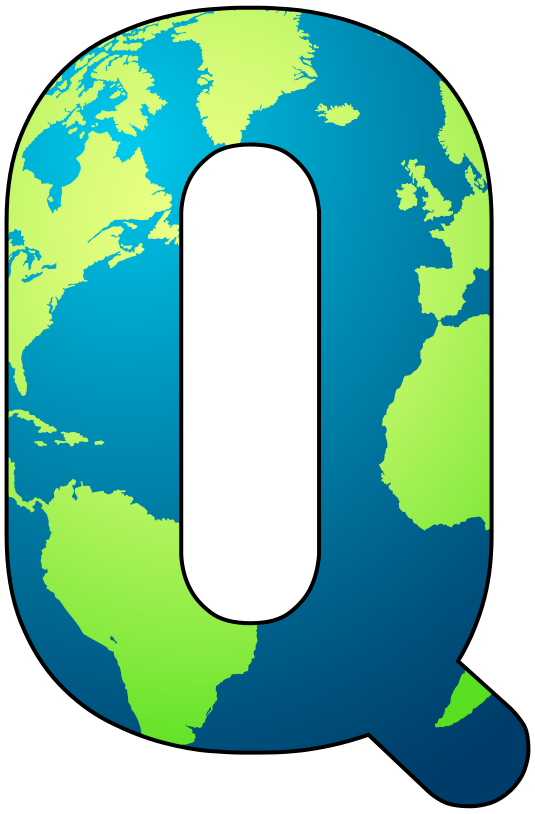

# quiZMap

**[Click here to see the project live](https://quizmap.herokuapp.com/)**

## About quiZMap

Every now and again I like to challenge myself to name all the countries in the world. It's not a terribly useful skill, but I find knowing geography important; if just for the fact that not enough people possess the knowledge. And while there are a bunch of websites that offer geography based quizzes, a lot of their maps are static. Conversely while there are a few quizzes that leverage Google Map's API, they don't seem to quiz users about basic geography. 

quiZMap brings geographic trivia with the Google Maps display to create an engaging experience that will help individuals learn about the world around them. Starting with naming countries (either by continent or of the whole world), quiZMap aims to provide a number of unique quizzes and resources that will make them entertaining and informative with the help of Google Maps. 

This application uses the MERN stack to create a timer based application that displays a GeoJSON polygon corresponding to a country's boundaries after a correct guess is entered.